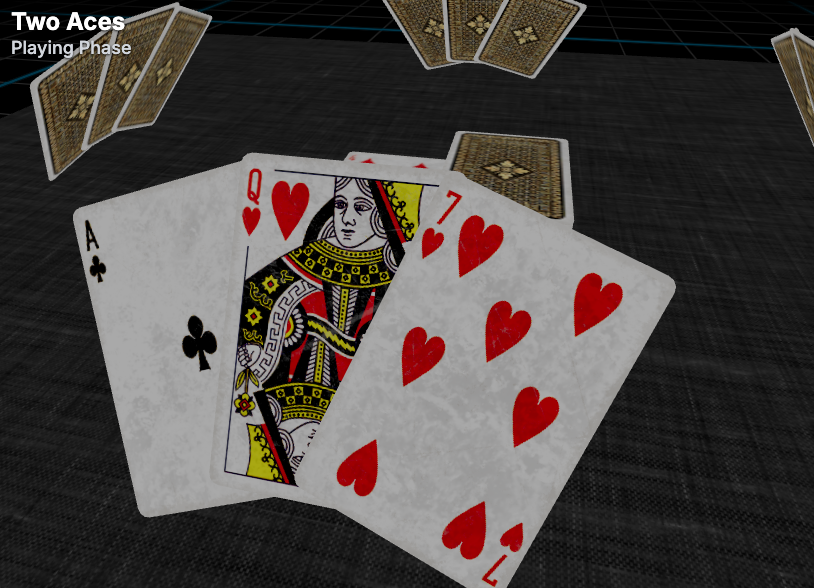

# Two Aces
Two Aces is a digital 3d multiplayer 52-card board game build with Krmx and ThreeJS.

> 
>
> A screenshot of two aces rendered in the browser.

## Getting Started
First, run the development server:
```bash
npm run dev
```
Then, open [http://localhost:3000](http://localhost:3000) with your browser to see the result.
